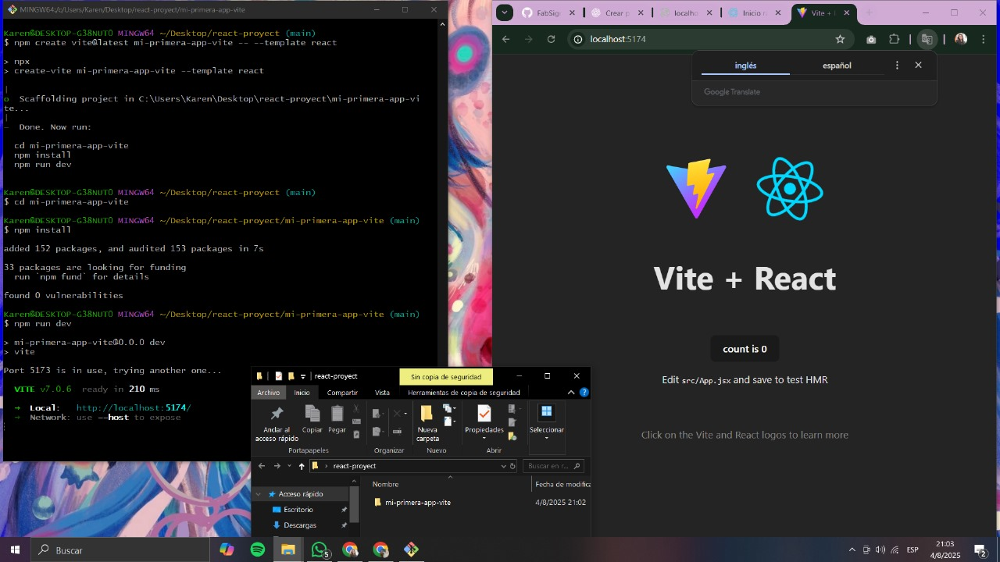

# Clase 1 – Instalando React + Vite

## ¿Qué es React?

**React** es una **biblioteca de JavaScript** creada por Meta (Facebook) para construir **interfaces de usuario interactivas** de forma declarativa y basada en componentes reutilizables.

[React](https://es.react.dev/)

A diferencia de un framework completo como Angular o Vue (que te dan una solución "todo en uno"), **React solo se ocupa de la capa de vista**. Esto significa que **no dicta reglas estrictas** sobre cómo manejar rutas, estados globales o estructurar tu proyecto: vos elegís qué librerías sumar según tus necesidades.

### ⚠️ Entonces, ¿por qué no es un framework?

- Porque **no resuelve todo el ciclo de vida de una aplicación** (por ejemplo, no incluye routing o manejo de estado global).
- Porque **necesita herramientas externas** para ciertas funcionalidades comunes (como React Router o Redux).
- Porque **su enfoque principal es la UI**, no la lógica de negocio ni la arquitectura completa.

---

## ⚡ ¿Qué es Vite?

**Vite** es una herramienta moderna para crear y ejecutar proyectos frontend. Su nombre significa "rápido", y esa es justamente su mayor ventaja. Está diseñado para reemplazar herramientas más lentas como `create-react-app`.

> Fue creado por Evan You (el autor de Vue.js), pero funciona perfectamente con React, Vanilla JS, Svelte, etc.

[Vite](https://vite.dev/guide/)

---

### 🚀 ¿Por qué usar Vite con React?

- 🔥 **Inicio instantáneo del servidor de desarrollo**.
- ⚡ **Recarga en caliente (HMR)** súper rápida al guardar cambios.
- 🧠 **Configuración mínima**, ya viene todo preparado.
- 🛠️ Soporte nativo para **JSX**, **TypeScript**, **Tailwind**, etc.
- 📦 Build rápido y optimizado para producción usando `esbuild`.

---

## 🧪 En resumen

React te da libertad y flexibilidad para construir componentes reutilizables, y **Vite te da un entorno de desarrollo moderno, rápido y simple** para hacerlo sin complicarte.

> ✨ Con esta combinación, empezás a desarrollar más rápido, ves los cambios al instante y te enfocás en aprender React sin pelear con la configuración.

---

## Objetivo de la clase

- Aprender a crear / instalar un proyecto React moderno usando Vite.
- Entender la estructura inicial del proyecto.
- Correr el servidor de desarrollo para ver la aplicación en el navegador.

---

## Pasos para instalar React + Vite

1. Abrir la terminal (git bash) y navegar a la carpeta donde queremos crear el proyecto (ejemplo: Escritorio):
```bash
cd ~/Desktop/react-proyect
```

2. Crear un nuevo proyecto con Vite usando el template React (Javascript):
```bash
npm create vite@latest mi-proyecto -- --template react
```
(Reemplazar nombre-del-proyecto por el nombre deseado)

3. Entrar a la carpeta del proyecto:
```bash
cd mi-proyecto
```

4. Instalar las dependencias:
```bash
npm install
```

5. Correr el servidor de desarrollo:
```bash
npm run dev
```

6. Abrir el navegador en la URL que muestra la terminal (por defecto suele ser http://localhost:5173/).

