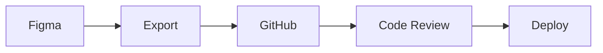

# 📚 Documentación del Proyecto - ColegioXYZ Web

## 🎯 Filosofía: "Documentación como Código"

La documentación evoluciona junto al proyecto, es versionada y siempre actualizada.

**Beneficios:**
- **Onboarding rápido:** nuevos devs entienden el proyecto en minutos
- **Handoff fluido:** diseñadores y developers hablan el mismo idioma
- **Mantenimiento:** código autodocumentado y decisiones rastreables

## 🗂️ Estructura del Repositorio

```
colegio-xyz-web/
├── 📄 README.md                    # Overview del proyecto
├── 📁 docs/
│   ├── 📄 figma-guide.md           # → Link a la guía de Figma
│   ├── 📄 DESIGN_SYSTEM.md         # Design tokens y componentes
│   ├── 📄 ACCESSIBILITY.md         # Guidelines WCAG
│   ├── 📄 COMPONENT_SPECS.md       # Mapping Figma → React
│   └── 📁 assets/
│       ├── screenshots/            # Capturas finales
│       └── user-flows/            # Diagramas de flujo
├── 📁 figma-exports/
│   ├── icons/                     # SVGs optimizados
│   ├── images/                    # Assets gráficos
│   └── design-tokens.json         # Tokens exportados
└── 📄 CONTRIBUTING.md              # Guía para colaboradores
```

## 📋 Contenido de Cada Documento

### README.md - Carta de Presentación
```markdown
# 🏫 ColegioXYZ - Sitio Web Institucional

## 🎯 Descripción
Sitio web institucional con enfoque en accesibilidad y UX.

## 🚀 Quick Start
git clone → npm install → npm run dev

## 📋 Stack
- Design: Figma + Design System
- Frontend: Next.js + TypeScript
- Styling: Tailwind CSS

## 🎨 Enlaces
- [Figma Design](link) • [Accessibility](docs/ACCESSIBILITY.md)
- [Components](docs/COMPONENT_SPECS.md)

## 👥 Audiencias
- Estudiantes (12-18) • Padres (35-50) • Docentes (25-65)
```

### DESIGN_SYSTEM.md - Fuente de Verdad Visual
```markdown
# 🎨 Design System

## 🔗 Figma Master File: [Link](figma-url)

## 🎯 Design Tokens
### Colores
:root {
  --primary-500: #3b82f6;
  --secondary-500: #10b981;
  --success: #22c55e;
}

### Espaciado (8px Grid)
--space-sm: 16px; --space-md: 24px; --space-lg: 32px;

## 🧩 Componentes
### Button
- Variants: primary | secondary | outline
- States: default | hover | disabled
```

### COMPONENT_SPECS.md - Mapping Figma → React
```markdown
# 🧩 Component Specifications

## ClimaCard Component

### Figma Reference
Master: `ClimaCard/Default`
Variants: Loading, Error, Success

### React Implementation
```typescript
interface ClimaCardProps {
  temperature: number;
  location: string;
  isLoading?: boolean;
  error?: string;
}
```

### CSS (Tailwind)
```css
.clima-card {
  @apply bg-white rounded-lg shadow-md p-6;
}
```

### Testing
```typescript
it('displays temperature correctly', () => {
  render(<ClimaCard temperature={21} location="La Plata" />);
  expect(screen.getByText('21°C')).toBeInTheDocument();
});
```
```

### ACCESSIBILITY.md - Compliance WCAG
```markdown
# ♿ Accesibilidad - WCAG 2.1 AA

## 📊 Métricas
- Contraste: ≥ 4.5:1
- Touch targets: ≥ 44px mobile
- Keyboard navigation: 100%

## 🔍 Testing
```bash
npm run test:a11y  # Lighthouse
npm run test:axe   # axe-core
```

## 🏷️ ARIA Patterns
### Navigation
```html
<nav aria-label="Navegación principal">
  <a href="/inicio" aria-current="page">Inicio</a>
</nav>
```

## ✅ Checklist
- [ ] Skip links implementados
- [ ] Alt text en todas las imágenes
- [ ] Jerarquía de headings correcta
- [ ] Focus visible en interactivos
```

## 🔄 Workflow de Sincronización



### Automatización (opcional)
```yaml
# .github/workflows/design-sync.yml
on:
  schedule:
    - cron: '0 9 * * MON'  # Lunes 9 AM

jobs:
  sync-tokens:
    steps:
      - Fetch Figma tokens
      - Create PR if changes
```

## 🏆 Beneficios

**Para el Equipo:**
- Onboarding 10x más rápido
- Decisiones documentadas
- Handoff sin fricción

**Para el Proyecto:**
- Código mantenible
- Patrones escalables
- Testing integrado

## ✅ Setup Inicial

### Semana 1:
- [ ] Crear repo con estructura
- [ ] Setup README.md
- [ ] Documentar design tokens
- [ ] [Completar guía de Figma](docs/figma-guide.md)

### Durante desarrollo:
- [ ] Actualizar COMPONENT_SPECS con cada componente
- [ ] Mantener screenshots actualizados
- [ ] Testing y accessibility

### Pre-launch:
- [ ] Review completo
- [ ] Screenshots finales
- [ ] Guía de deployment

**La documentación es el puente entre el diseño y el código.**